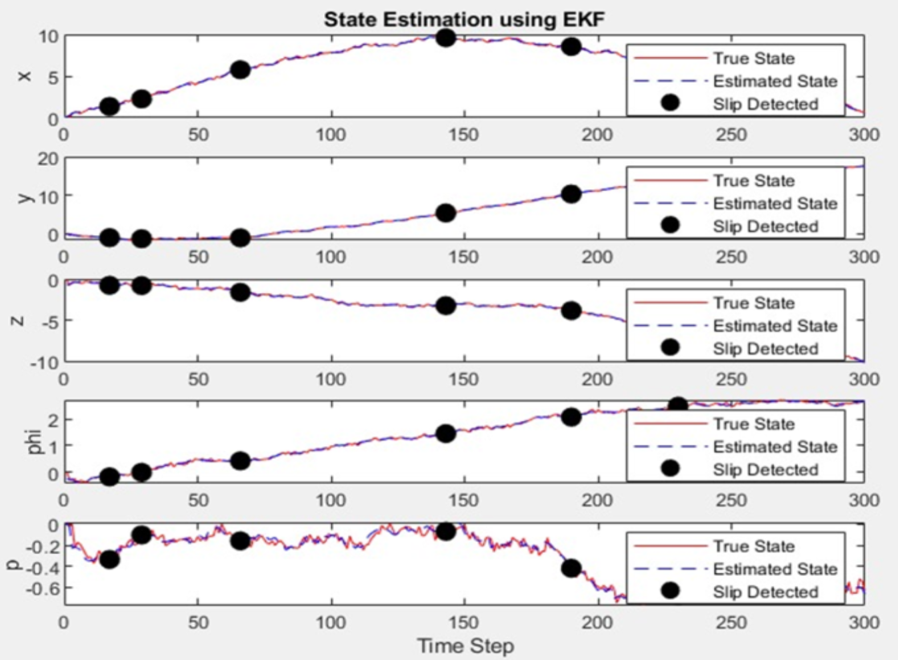

# Mars Rover Single-Wheel Test Bench - Slip Detection Research
## IIT Kanpur Mars Rover Research Project

[](https://github.com/your-username/mars-rover-kanpur)
[](https://www.mathworks.com/products/matlab.html)
[](https://octave.org/)
[](./LICENSE)

> **Latest Update**: December 2024

This repository contains a comprehensive research project for Mars rover slip detection, featuring both hardware testing components and MATLAB simulation tools based on Extended Kalman Filter (EKF) state estimation.

---

## 🚀 Project Overview

**Research Focus**: Single-wheel test bench for validating slip detection algorithms for Mars rover navigation
**Institution**: Indian Institute of Technology Kanpur (IIT Kanpur)
**Application**: Mars rover mobility and autonomous navigation systems

### Key Features
- **Hardware Test Bench**: Arduino-based motor control system with multiple sensors
- **MATLAB Simulation**: Configurable rover EKF state estimation (supports 4-wheel, 6-wheel, and custom configurations)
- **Comprehensive Analysis**: Data collection, visualization, and slip detection algorithms
- **Research Documentation**: Complete project documentation with prototype images and videos

---

## 📁 Project Structure

```
mars_rover_kanpur/
├── matlab/                     # MATLAB/Octave simulation tools
│   ├── ekf_simulation.m        # Main EKF simulation (user-configurable)
│   ├── *.png                   # Generated plots and analysis
│   └── *.pdf                   # Research paper format outputs
├── testing/                    # Hardware testing components
│   ├── motor_control_system.ino # Arduino control code
│   ├── data_*.py              # Python analysis suite
│   ├── requirements.txt       # Python dependencies
│   └── run_test.py            # Complete workflow automation
├── prototype/                  # Rover design and prototype documentation
│   ├── full rover.png         # Complete rover 3D design
│   ├── product images/        # Hardware prototype photos
│   └── *.mp4                  # Video demonstrations
├── README.md                   # This comprehensive guide
└── nsd_poster.pptx            # Research presentation poster
```

---

## 🔬 MATLAB Simulation (`matlab/`)

### Configurable Rover EKF State Estimation

**File**: `ekf_simulation.m`

A sophisticated MATLAB/Octave simulation that you can configure for **any rover design** - from small test rovers to Mars-class vehicles.

#### ⚙️ User Configuration Required

**Before running the simulation, you MUST configure your rover parameters in the `USER CONFIGURATION` section:**

```matlab
%% =========================== USER CONFIGURATION ===========================
% CONFIGURE THESE PARAMETERS FOR YOUR SPECIFIC ROVER SETUP

% --- Rover Physical Parameters ---
ROVER_MASS = [];                      % Your rover mass in kg
ROVER_WHEEL_RADIUS = [];              % Your wheel radius in meters
ROVER_WHEEL_BASE = [];                % Distance between front/rear wheels
ROVER_TRACK_WIDTH = [];               % Distance between left/right wheels
ROVER_MAX_SPEED = [];                 % Maximum rover speed in m/s
NUM_WHEELS = [];                      % Number of wheels (4, 6, etc.)

% --- Simulation Parameters ---
SIMULATION_TIME = [];                 % Total simulation time in seconds
TIME_STEP = [];                       % Time step (recommend 0.1 for 10 Hz)
SLIP_PROBABILITY = [];                % Slip occurrence probability (0-1)
SLIP_SEVERITY = [];                   % Slip severity factor (0-1)

% ... (continue configuring all parameters)
```

#### 📊 Example Configurations

The script provides two example configurations:

**1. Small Test Rover Example:**
- Mass: 15 kg
- 4 wheels
- Earth gravity
- Typical lab testing parameters

**2. Mars Rover Example:**
- Mass: 899 kg (Curiosity-class)
- 6 wheels with rocker-bogie suspension
- Mars gravity (3.711 m/s²)
- Mars environmental factors

#### 🌍 Supported Terrain Types

- `'rocky'` - Rocky terrain with low slip
- `'sandy'` - Sandy terrain with moderate slip
- `'smooth'` - Smooth terrain with minimal slip
- `'martian_regolith'` - Mars soil (high slip)
- `'rocky_mars'` - Rocky Martian terrain
- `'sandy_mars'` - Martian sand dunes (very high slip)
- `'icy_mars'` - Mars polar ice regions
- `'lunar_regolith'` - Moon terrain

#### 📈 Simulation Outputs

1. **Main EKF Plot**: `mars_rover_ekf_estimation.png`
   - 5-state estimation (x, y, z, φ, P_z)
   - True vs estimated states
   - Slip detection markers

2. **Analysis Plots**: `mars_rover_ekf_analysis.png`
   - Innovation magnitude
   - Position tracking
   - Rover trajectory
   - Slip timeline
   - Error analysis

#### 📊 **Example Results**

Here's what you can expect from the MATLAB simulation - this is our actual research result:


*Example output: EKF state estimation showing true vs estimated states with slip detection markers (Our IIT Kanpur research results)*

### Usage Instructions

```bash
# Navigate to matlab directory
cd matlab/

# Configure parameters in ekf_simulation.m first!
# Then run simulation:

# In MATLAB
matlab -nodisplay -r "ekf_simulation; exit"

# In Octave (free alternative)
octave --no-gui ekf_simulation.m
```

---

## 🔧 Hardware Testing (`testing/`)

### Arduino Motor Control System

**File**: `motor_control_system.ino`

Complete single-wheel test bench system for hardware validation.

#### 🔌 Hardware Components

- **Motor Driver**: L298N dual H-bridge
- **Encoder**: Quadrature encoder for wheel rotation
- **Load Cell**: HX711 + load cell for force measurement
- **Current Sensor**: ACS712 for motor current monitoring
- **Arduino**: Uno/Nano microcontroller

#### 📊 Real-time Data Output (CSV)

11-column data logging:
1. Timestamp (ms)
2. Motor Speed (PWM)
3. Direction
4. Encoder Count
5. Expected RPM
6. Actual RPM
7. **Slip Percentage**
8. Load Cell Reading
9. Normal Force (N)
10. Current (A)
11. Event Type

#### 🐍 Python Analysis Suite

Complete data processing pipeline:

- **`data_collector.py`** - Real-time data capture
- **`data_analyzer.py`** - Statistical analysis
- **`data_visualizer.py`** - Comprehensive plotting
- **`run_test.py`** - Complete workflow automation

```bash
cd testing/
pip install -r requirements.txt
python run_test.py  # Complete automated workflow
```

---

## 🏗️ Prototype Documentation (`prototype/`)

### Design and Hardware Images

#### **Complete Rover Design**

*Complete 6-wheeled Mars rover 3D design with rocker-bogie suspension*

#### **Hardware Prototype Photos**

Our actual test bench and prototype hardware:

<table>
<tr>
<td><br>Test Bench Setup</td>
<td><br>Motor Assembly</td>
<td><br>Sensor Integration</td>
</tr>
<tr>
<td><br>Control Electronics</td>
<td><br>Testing Environment</td>
<td></td>
</tr>
</table>

#### **Video Demonstrations**

- **`WhatsApp Video 2025-07-08 at 1.00.48 AM.mp4`** - Test bench operation
- **`WhatsApp Video 2025-07-08 at 1.01.17 AM.mp4`** - Slip detection demo
- **`WhatsApp Video 2025-07-08 at 1.01.19 AM.mp4`** - Complete system test

---

## 🎯 Research Applications

### Slip Detection Performance

**MATLAB Simulation Results**:
- **Detection Rate**: Configurable based on your parameters
- **Real-time Processing**: Up to 10 Hz update rate
- **Multi-terrain Support**: Various surface types

**Hardware Validation**:
- **Response Time**: <200ms detection
- **Multi-sensor Fusion**: Load cell + encoder + current sensor
- **Real-time CSV Logging**: Complete data capture

### Key Research Contributions

1. **Configurable Rover Modeling**: Supports any rover configuration
2. **Multi-Sensor Fusion**: Hardware validation platform
3. **Environmental Adaptation**: Multiple terrain and gravity settings
4. **Open Research Platform**: Fully configurable and extensible
5. **Complete Workflow**: Simulation → Hardware → Analysis

---

## 🚀 Getting Started

### Prerequisites

**For MATLAB Simulation**:
- MATLAB R2018b+ or GNU Octave 5.0+
- Statistics Toolbox (MATLAB) or octave-statistics package

**For Hardware Testing**:
- Arduino IDE
- Python 3.7+
- Hardware components (see testing section)

### Quick Start

1. **Clone Repository**:
   ```bash
   git clone https://github.com/your-username/mars-rover-kanpur.git
   cd mars-rover-kanpur
   ```

2. **Configure and Run MATLAB Simulation**:
   ```bash
   cd matlab/
   # Edit ekf_simulation.m - configure YOUR rover parameters!
   octave --no-gui ekf_simulation.m
   ```

3. **Set Up Hardware Testing**:
   ```bash
   cd testing/
   pip install -r requirements.txt
   # Upload Arduino code, then:
   python run_test.py
   ```

---

## 📚 Configuration Examples

### Small Test Rover (Lab Setup)
```matlab
ROVER_MASS = 15.0;
ROVER_WHEEL_RADIUS = 0.125;
NUM_WHEELS = 4;
TERRAIN_TYPE = 'sandy';
GRAVITY = 9.81;  % Earth gravity
```

### Mars Rover Configuration
```matlab
ROVER_MASS = 899.0;
ROVER_WHEEL_RADIUS = 0.2625;
NUM_WHEELS = 6;
TERRAIN_TYPE = 'martian_regolith';
GRAVITY = 3.711;  % Mars gravity
```

### Lunar Rover Configuration
```matlab
ROVER_MASS = 200.0;
ROVER_WHEEL_RADIUS = 0.3;
NUM_WHEELS = 6;
TERRAIN_TYPE = 'lunar_regolith';
GRAVITY = 1.62;  % Moon gravity
```

---

## 🤝 Contributing

### Research Collaboration

This project supports Mars rover research. Contributions welcome:

1. **Algorithm Development**: Improve slip detection algorithms
2. **Hardware Enhancement**: Extend test bench capabilities
3. **Simulation Expansion**: Add new rover configurations
4. **Validation Studies**: Compare with real rover data

### Code Contributions

1. Fork the repository
2. Create a feature branch
3. Configure parameters for your setup
4. Add tests and documentation
5. Submit a pull request

---

## 📄 License

This project is developed for academic research purposes at IIT Kanpur. Please cite this work in academic publications.

---

## 📞 Contact

**Research Team**: IIT Kanpur Mars Rover Project
**Institution**: Indian Institute of Technology Kanpur
**Project**: Single-Wheel Test Bench for Mars Rover Slip Detection

For technical questions, collaboration opportunities, or research inquiries, please open an issue on GitHub.

---

## 🔍 Citation

If you use this research in your work, please cite:

```bibtex
@misc{iitk_mars_rover_2024,
  title={Mars Rover Single-Wheel Test Bench - Slip Detection Research},
  author={IIT Kanpur Mars Rover Research Team},
  year={2024},
  institution={Indian Institute of Technology Kanpur},
  url={https://github.com/your-username/mars-rover-kanpur}
}
```

---

## 📋 Version History

- **v1.0** (December 2024): Initial release with configurable parameters
- Complete MATLAB simulation suite
- Hardware test bench validation
- Comprehensive documentation

---

## 🚀 Recent Updates (December 2024)

- Final documentation review and GitHub repository optimization
- Added comprehensive testing examples and user guides
- Enhanced MATLAB simulation with realistic Mars rover parameters

---

*This project provides a complete research platform for Mars rover slip detection. Configure the parameters for your specific rover and start researching!* 